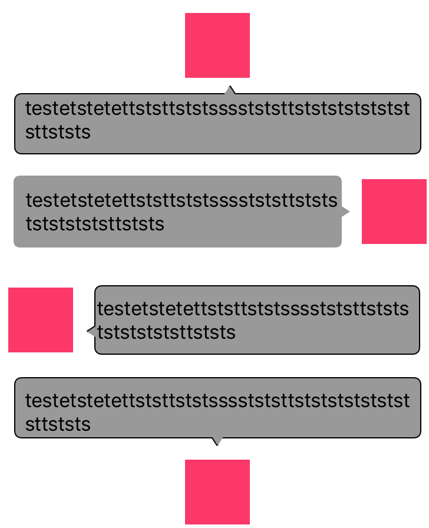
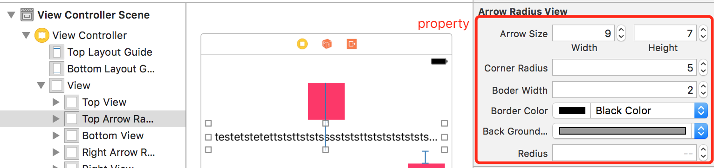

# ArrowRadiusView

[](https://github.com/zengxianshu/ArrowRadiusView)
[](https://github.com/zengxianshu/ArrowRadiusView)
[](https://developer.apple.com/swift/)
[](https://github.com/zengxianshu/ArrowRadiusView)
[](https://github.com/zengxianshu/ArrowRadiusView)

# effect


## Requirements

## Installation

ArrowRadiusView is available through [CocoaPods](http://cocoapods.org). To install
it, simply add the following line to your Podfile:
```ruby
use_frameworks!
pod 'ArrowRadiusView' :git => 'https://github.com/zengxianshu/ArrowRadiusView.git'
```


## Author

曾墨, zengxsios@gmail.com

## License

ArrowRadiusView is available under the MIT license. See the LICENSE file for more info.
